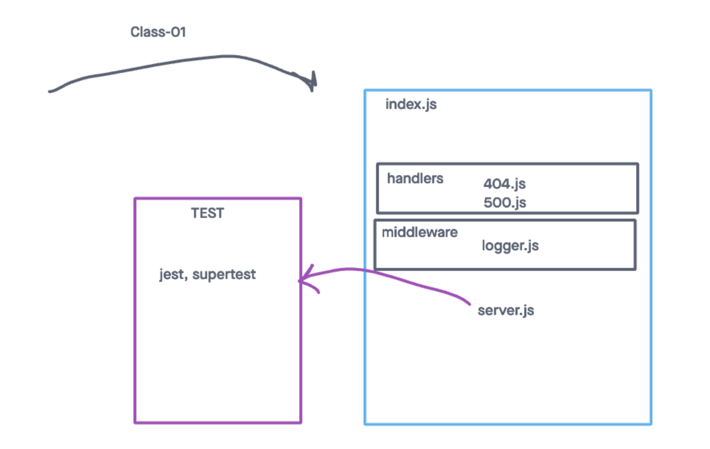

# LAB - Class 01

## Project: Server Deployment Practice

### Author: Ryan Gallaway

### Problem Domain  

Create a web server using CI and CD and get used to the general process of building and deploying servers, and prepping your work for grading

### Links and Resources

- [ci/cd](https://github.com/rkgallaway/server-deployment-practice-d49/actions) (GitHub Actions)
- [prod deployment](https://four01d49-server-deploy-prod.onrender.com/) 
- [dev deployment](https://four01d49-server-deploy-dev.onrender.com/) 

### Setup

#### `.env` requirements 

see `.env.sample`
- PORT: 3001

#### How to initialize/run your application 

- nodemon

#### Features / Routes

- Feature One: deploy to dev
- GET : `/` - specific route to hit
- GET : `bad` - specific route to hit

- Feature Two: deploy to prod
- GET : `/hello` - specific route to hit
- GET : `bad` - specific route to hit

#### Tests

- How do you run tests?
   - npm test 
- Any tests of note?
   - handles root path
   - handles invalid requests
   - handles errors

#### UML

